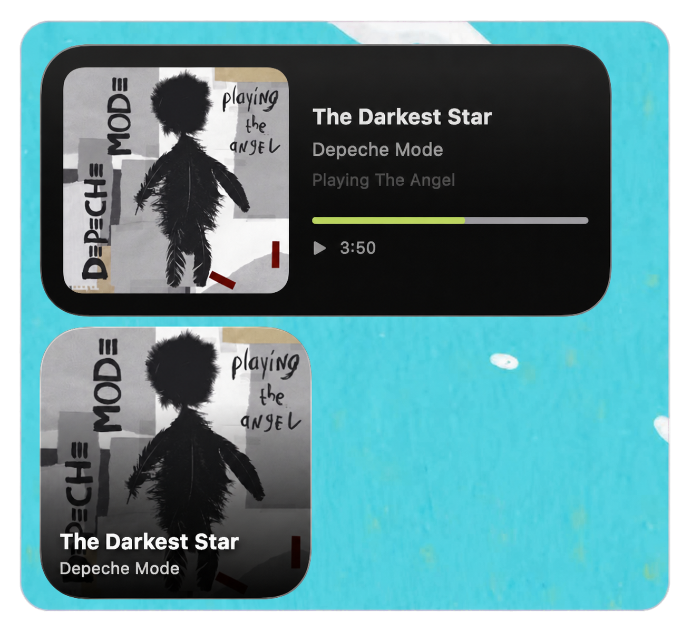

# Now Playing Widget for macOS

A **real WidgetKit desktop / Notification Center widget** that mirrors the system-wide macOS Now Playing session across compatible media players.

<p align="center">
  
</p>

## What it does

- Reads system-wide Now Playing metadata in a tiny background helper.
- Shows title, artist, album, artwork, play/pause state and approximate progress.
- Supports macOS **small** and **medium** WidgetKit sizes.
- **Does not use App Groups.** The helper exposes the current snapshot to the widget over a localhost-only bridge.
- Runs as an accessory/background app (`LSUIElement`) so it does not occupy the Dock.

## Why there is a helper app

WidgetKit extensions are intentionally constrained and are not a good place to keep a live MediaRemote listener. The helper listens for playback changes and asks WidgetKit to reload. When the widget refreshes, it reads the latest snapshot from the helper at `127.0.0.1:47391`.

For macOS 15.4+, direct third-party access to the private MediaRemote framework stopped working. This project uses `ejbills/mediaremote-adapter`, a Swift Package wrapper around the maintained MediaRemote adapter approach.

## Build — no paid Apple Developer membership required

Requirements:

- macOS 15.4+
- Xcode
- XcodeGen (`brew install xcodegen`)

Then:

```sh
./setup.sh
```

In Xcode:

1. Select the **NowPlayingWidget** scheme.
2. If Xcode offers **Sign to Run Locally**, use it. Otherwise signing with a normal Apple Account / Personal Team is sufficient for local development; a paid membership is not required.
3. Run the app once (`⌘R`).
4. Add **Now Playing** from macOS's widget gallery.
5. Start a track in any compatible media player.

There is **no App Group to configure** and no paid capability to register.

## Important limitations

- Keep the tiny helper app running. If it is not running, the widget has nothing to read and shows “Nothing Playing.”
- WidgetKit controls its own refresh budget. Track/state changes call `reloadTimelines`, but the OS may occasionally coalesce reloads.
- The progress bar is intentionally approximate between widget refreshes; WidgetKit is not a 1 Hz UI surface.
- MediaRemote is private API territory. The adapter currently targets the post-macOS-15.4 situation, but a future macOS release can break it again.
- Because this relies on private-system behavior, treat it as a personal utility rather than something intended for Mac App Store distribution.

## Architecture

```text
Compatible macOS media player
          │
          ▼
macOS Now Playing / MediaRemote
          │
          ▼
NowPlayingWidget helper (background)
          │
  localhost snapshot :47391
          │
          ▼
WidgetKit extension
          │
          ▼
Desktop / Notification Center widget
```

## Frameworks and system technologies

- **SwiftUI** builds the app and widget presentation.
- **WidgetKit** provides the small and medium desktop / Notification Center widgets.
- **MediaRemoteAdapter** wraps the private macOS MediaRemote interface used to observe the system-wide Now Playing session.
- **Network** serves the latest snapshot over a localhost-only HTTP bridge.
- **ImageIO** decodes and prepares album artwork for WidgetKit.
